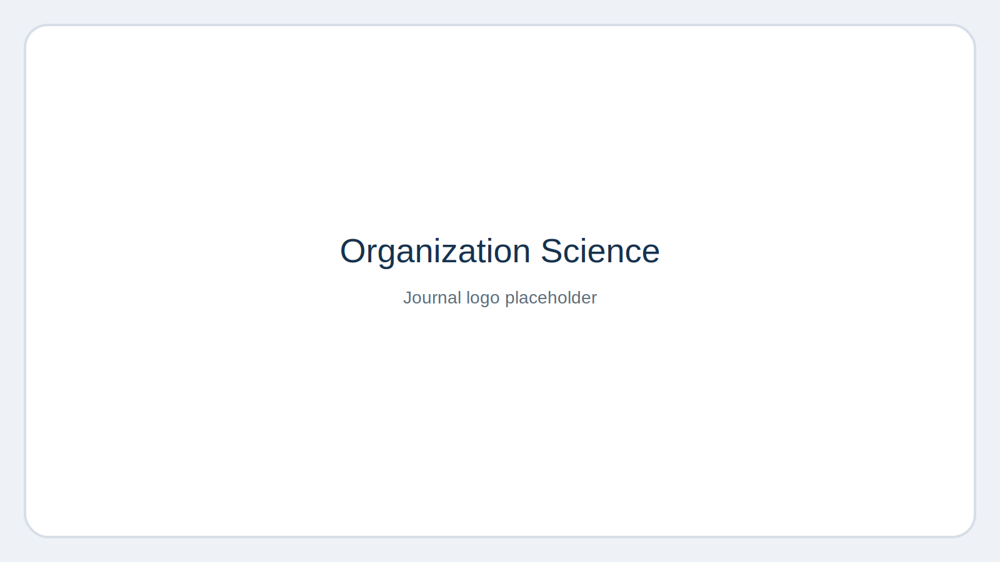
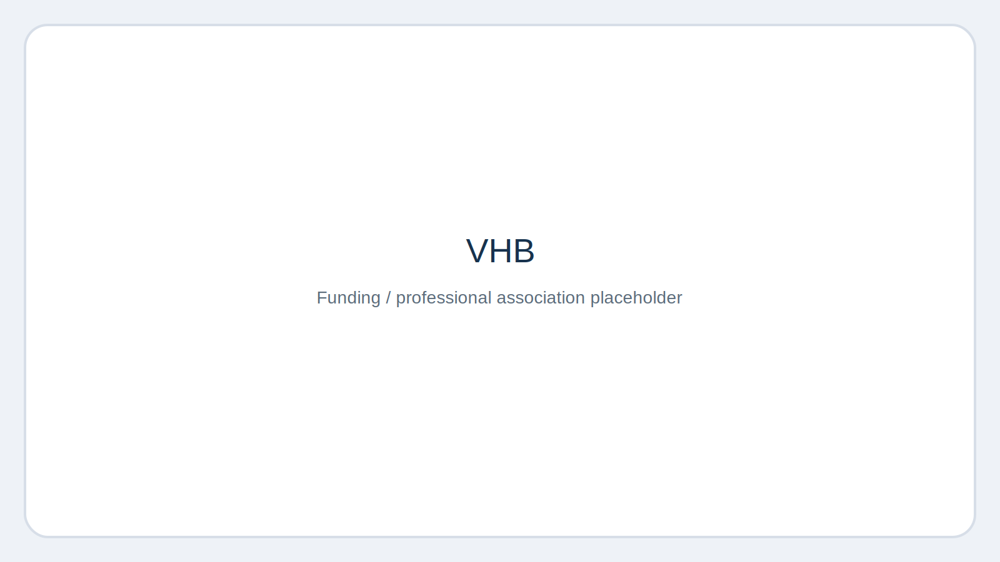
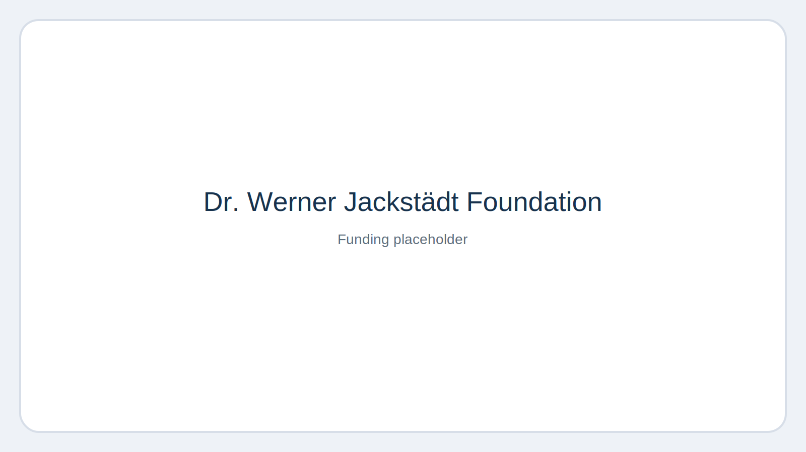
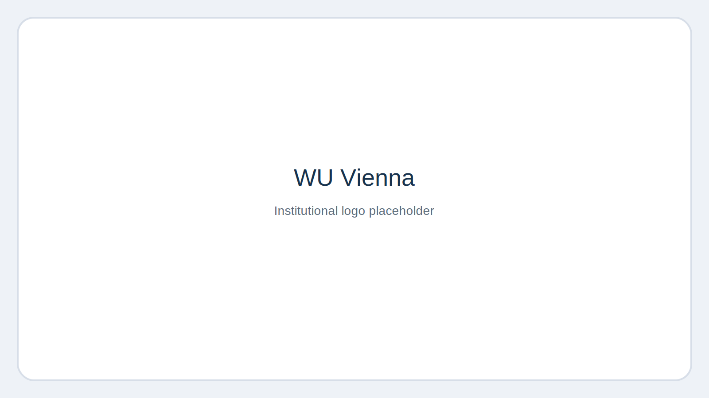
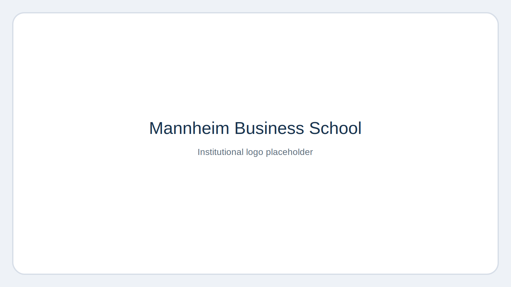
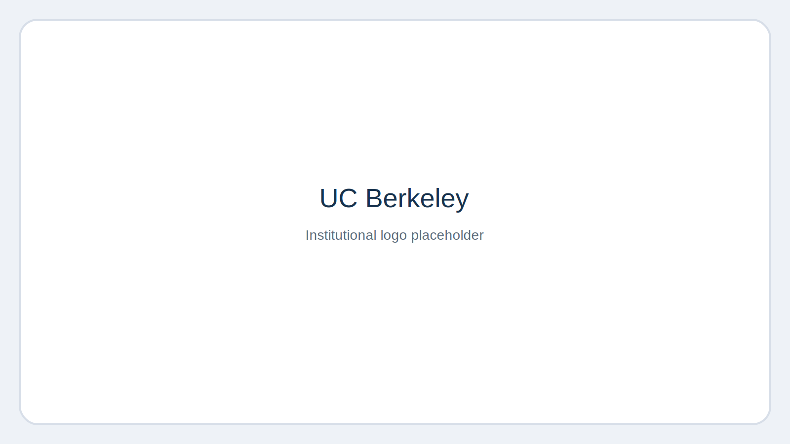
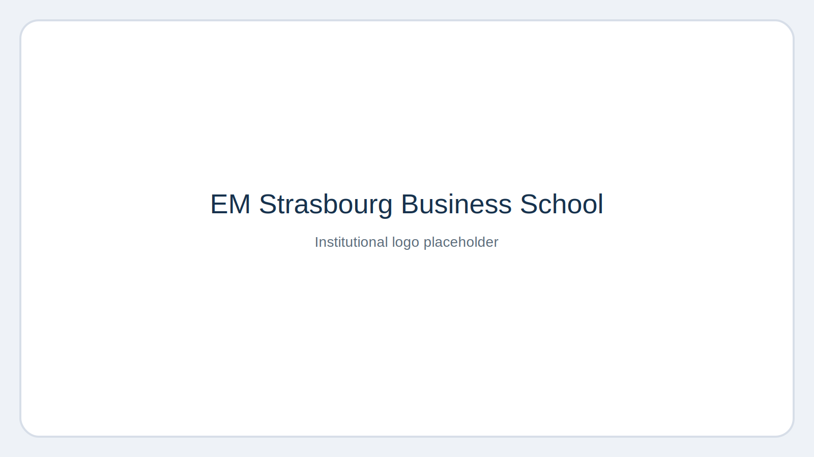

# Andrew Isaak

Assistant Professor  
University of Wuppertal

Visiting Professor of Business (2025–2026)  
EM Strasbourg Business School

::: {.grid}
::: {.g-col-12 .g-col-md-8}
## Research

I am an academic researcher in entrepreneurship, innovation, and sustainable business, with a particular interest in digital entrepreneurship, artificial intelligence, entrepreneurial finance, and sustainability transitions. My work combines theory-driven empirical research with strong practical relevance.

My current main affiliation is with the University of Wuppertal. Previously, I held a recent appointment at WU Vienna and continued teaching there through March while also supervising bachelor’s and master’s theses. I have also taught at Mannheim Business School and served as a Visiting Scholar at the University of California, Berkeley.

## Job Market Paper

**Isaak, A., Istipliler, B., Bort, S., & Woywode, M.**  
*Regulation, Corruption and Decentralized Autonomous Organizations: Insights from Bitcoin Trading and Platform Founding between 2011 and 2023.*  
*Organization Science* (forthcoming; ABS 4\*, VHB A+)

[Published article page](https://pubsonline.informs.org/doi/full/10.1287/orsc.2023.18467)

## Selected Highlights

- ∼ €48.8k **Fit for Funding Fellowship** (VHB & Dr. Werner Jackstädt Foundation) for a project on AI and sustainability
- **Research Award**, WU Vienna (2025)
- **PhD (Dr. rer. pol., magna cum laude)**, University of Mannheim
- **Visiting Scholar**, University of California, Berkeley
- Teaching experience in **English and German**
- International teaching experience across **Germany, Austria, France, South Korea, Sweden, China, and the UK**
- Research and reviewing activity spanning entrepreneurship, innovation, sustainability, and information systems

## Research Interests

- Digital Entrepreneurship
- Artificial Intelligence and Organizations
- Sustainable Innovation and Circular Economy
- Entrepreneurial Finance and Crowdfunding
- Regulation and Legitimacy in New Digital Markets

## Contact

Email: [isaak@wiwi.uni-wuppertal.de](mailto:isaak@wiwi.uni-wuppertal.de)  
ORCID: [0000-0001-5822-4355](https://orcid.org/0000-0001-5822-4355)

[Research](research.qmd) · [Teaching](teaching.qmd) · [German profile](index_de.qmd)
:::

::: {.g-col-12 .g-col-md-4}
{fig-alt="Organization Science placeholder visual" width="100%"}

{fig-alt="VHB placeholder visual" width="100%"}

{fig-alt="Jackstädt Foundation placeholder visual" width="100%"}
:::
:::

## Affiliations

::: {.grid}
::: {.g-col-6 .g-col-md-3}
{fig-alt="WU Vienna placeholder visual" width="100%"}
:::
::: {.g-col-6 .g-col-md-3}
{fig-alt="Mannheim Business School placeholder visual" width="100%"}
:::
::: {.g-col-6 .g-col-md-3}
{fig-alt="UC Berkeley placeholder visual" width="100%"}
:::
::: {.g-col-6 .g-col-md-3}
{fig-alt="EM Strasbourg Business School placeholder visual" width="100%"}
:::
:::
