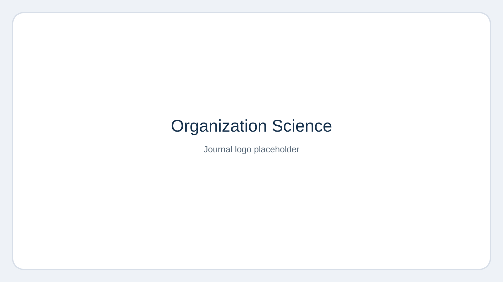
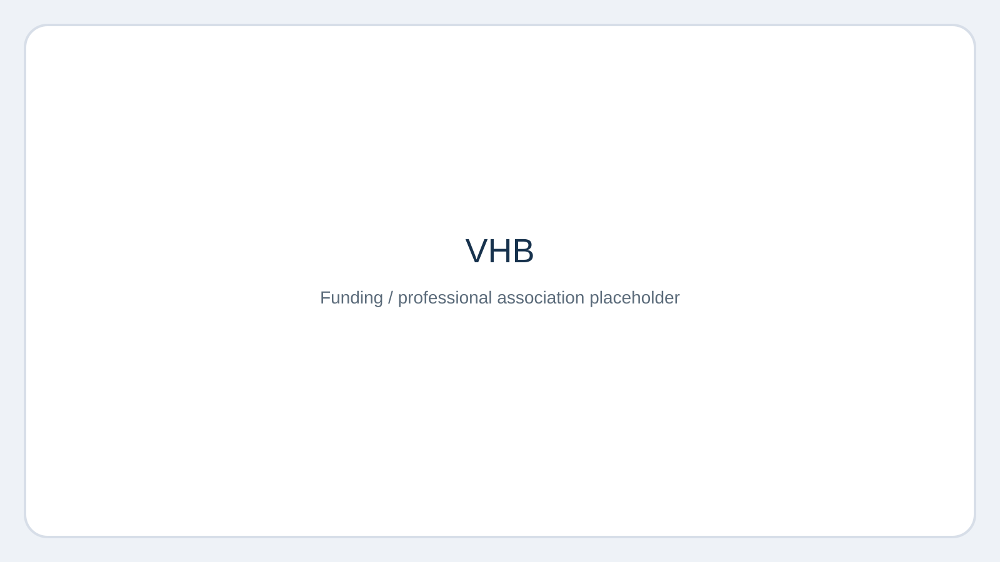
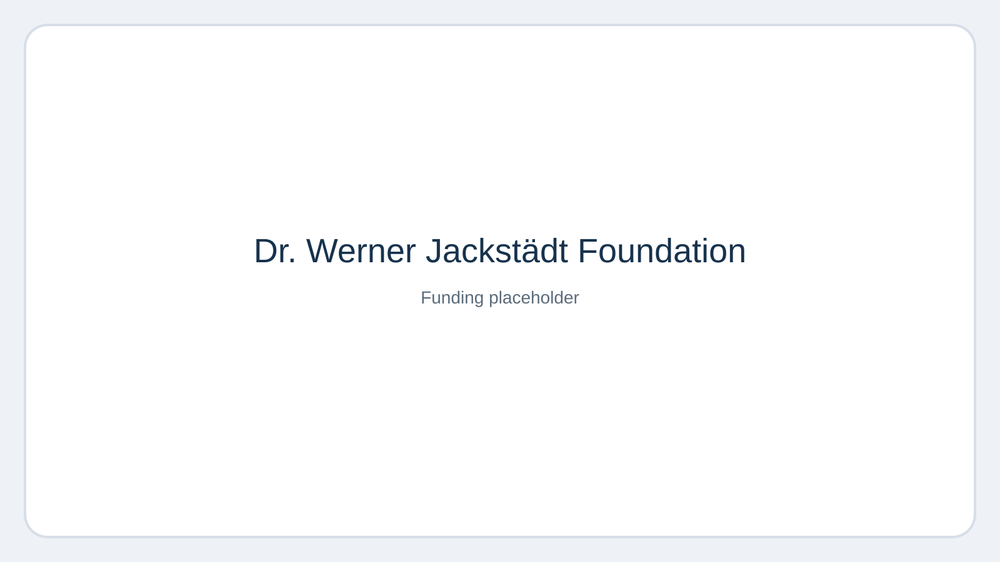
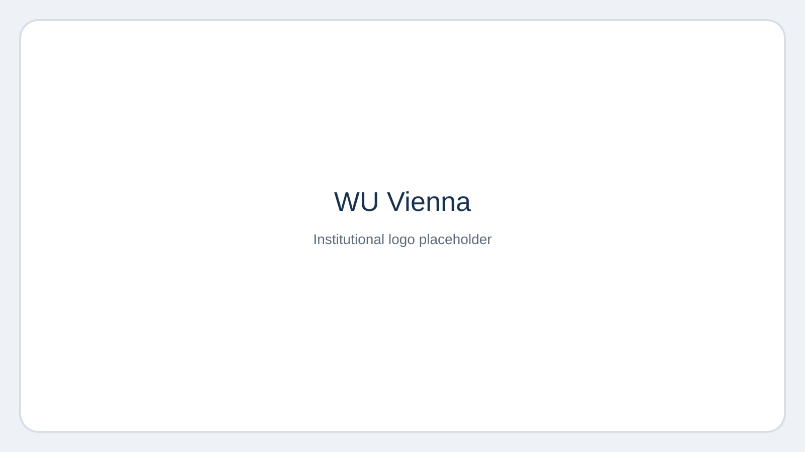
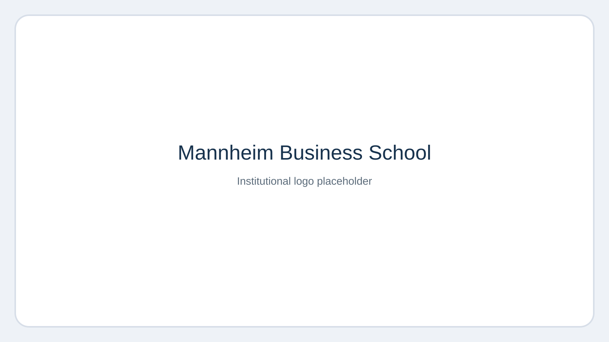
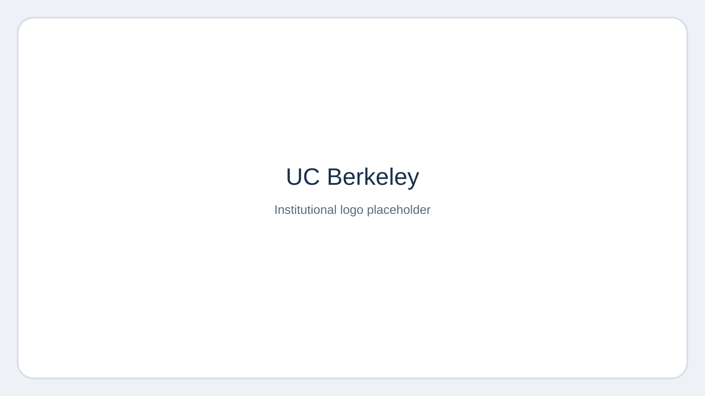
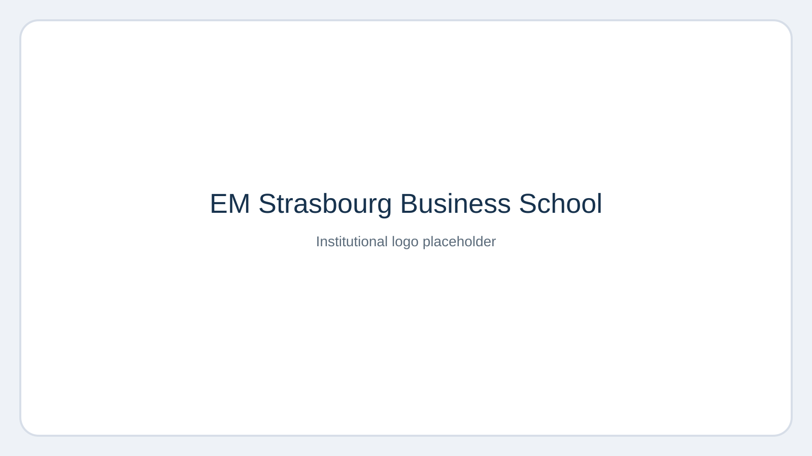

# Dr. Andrew Isaak

Assistant Professor  
University of Wuppertal

Visiting Professor of Business (2025–2026)  
EM Strasbourg Business School

::: {.grid}
::: {.g-col-12 .g-col-md-8}
## Research

I conduct academic both quantitative and qualitative research in entrepreneurship, innovation, and sustainable business, with a particular interest in digital entrepreneurship, artificial intelligence, entrepreneurial finance, as well as sustainability transitions. My work combines theory-driven empirical research with strong practical relevance. Among others, I study how new digital markets (e.g. Cryptocurrencies, ICOs) and entrepreneurial ecosystems (e.g., AI Startups) emerge in different institional environments and regulatory regimes. I am also interested in equity crowdfunding and use text analytic methods and machine learning to examine how campaign narratives shape funding outcomes for sustainability-oriented entrepreneurs.

My current main affiliation is with the University of Wuppertal as a (senior) postdoctoral researcher. At Wuppertal, I hold lectures and seminars such as entrepreneurship and growth and case studies in entrepreneurship (e.g., Car- & Ride-sharing, Space Tourism, EVs, and others). Previously, I held appointments at the Vienna University of Economics and Business (WU Vienna/Austria), the University of Düsseldorf (HHU/Germany), Solbridge International School of Business (Woosong University/South Korea) and at U.C. Berkeley (Visitng Scholar) as part of my PhD in Digital Entrepreneurship at the University of Mannheim. Since my PhD I have maintained close connections to Mannheim in teaching and research and teach at Mannheim Business School's MBA program and at EM Strasbourg Business School's Bachelor and Master of Science programs in the semester breaks.

## Job Market Paper (based on the last paper of my cumulative disseration)

**Isaak, A., Istipliler, B., Bort, S., & Woywode, M.**  
*Regulation, Corruption and Decentralized Autonomous Organizations: Insights from Bitcoin Trading and Platform Founding between 2011 and 2023.*  
*Organization Science*36(6), 2210-2244*(ABS 4\*, VHB A+\*,Utd24)

[Published article page](https://pubsonline.informs.org/doi/full/10.1287/orsc.2023.18467)

## Selected Highlights

- ∼ €48.8k **Fit for Funding Fellowship** (VHB & Dr. Werner Jackstädt Foundation) for a project on AI and sustainability
- **Best Paper Award**, WU Vienna (2026)
- **Research Award**, WU Vienna (2025)
- **PhD (Dr. rer. pol., magna cum laude)**, University of Mannheim
- **Visiting Scholar**, University of California, Berkeley
- 
- Teaching experience in **English and German** at all levels (BSc, MSc, PhD and executive education)
- International teaching experience across **Germany, Austria, France, South Korea, Sweden, China, and the UK**
- Research and reviewing activity spanning entrepreneurship, innovation, sustainability, and information systems
- Associate Editor, International Journal of Innovation Science
- Editorial Review Board, Information Systems Journal *(ABS 3\*, VHB A\*)

## Research Interests

- Digital Entrepreneurship
- Artificial Intelligence and Decentralized Organizations
- Sustainable Innovation and Circular Economy
- Entrepreneurial Finance and Crowdfunding
- Regulation and Legitimacy in New Digital Markets

## Contact

Email: [isaak@wiwi.uni-wuppertal.de](mailto:isaak@wiwi.uni-wuppertal.de)  
ORCID: [0000-0001-5822-4355](https://orcid.org/0000-0001-5822-4355)

[Research](research.qmd) · [Teaching](teaching.qmd) · [German profile](index_de.qmd)
:::

::: {.g-col-12 .g-col-md-4}
{fig-alt="Organization Science placeholder visual" width="100%"}

{fig-alt="VHB placeholder visual" width="100%"}

{fig-alt="Jackstädt Foundation placeholder visual" width="100%"}
:::
:::

## Affiliations

::: {.grid}
::: {.g-col-6 .g-col-md-3}
{fig-alt="WU Vienna placeholder visual" width="100%"}
:::
::: {.g-col-6 .g-col-md-3}
{fig-alt="Mannheim Business School placeholder visual" width="100%"}
:::
::: {.g-col-6 .g-col-md-3}
{fig-alt="UC Berkeley placeholder visual" width="100%"}
:::
::: {.g-col-6 .g-col-md-3}
{fig-alt="EM Strasbourg Business School placeholder visual" width="100%"}
:::
:::
