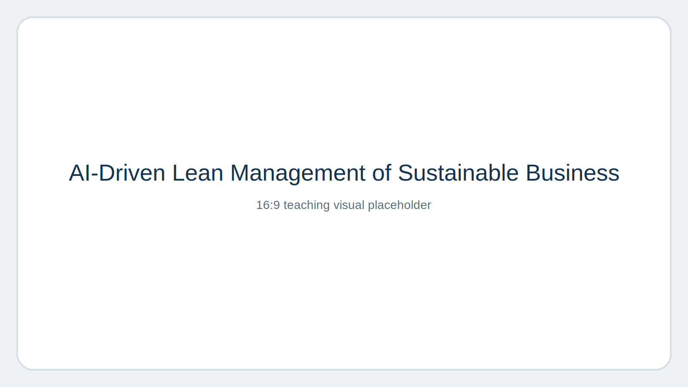
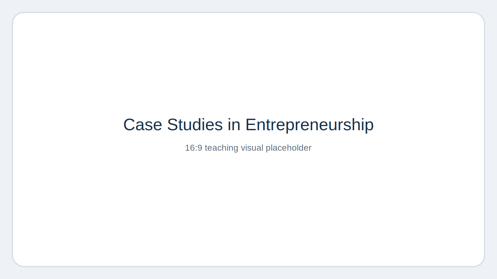
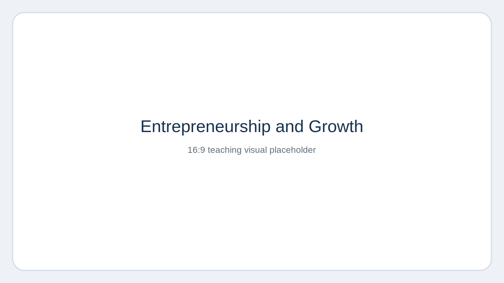

# Teaching

I have taught in English and German across undergraduate, graduate, MBA, executive, and doctoral settings. My teaching combines research-informed content with application-oriented formats, including project-based learning, case work, entrepreneurial experimentation, and engagement with practice partners.

## Sample Course Visuals

::: {.grid}
::: {.g-col-12 .g-col-md-4}
{fig-alt="AI-driven course placeholder visual" width="100%"}
:::
::: {.g-col-12 .g-col-md-4}
{fig-alt="Entrepreneurship case course placeholder visual" width="100%"}
:::
::: {.g-col-12 .g-col-md-4}
{fig-alt="Entrepreneurship growth course placeholder visual" width="100%"}
:::
:::

## Selected Courses

### Bergische Universität Wuppertal
- Entrepreneurship und Gründungsmanagement (Lecture, Bachelor), SoSe 2026
- Fallstudien im Gründungsmanagement (Seminar, Bachelor), SoSe 2026, WiSe 2025
- PhD Seminar: Research Methods in Entrepreneurship and Innovation, WiSe 2026 (planned)

### WU Vienna
- Crowdfunding and AI in Theory and Practice (Seminar, MSc), WiSe 2025/2026
- Crowdfunding (Seminar, BSc), SoSe 2025
- Grundlagen Wissenschaftliches Arbeitens (Seminar, BSc), SoSe 2025
- Design Thinking – Project Course (Seminar, BSc), SoSe 2025, WiSe 2024
- Consulting 1 – Project Course (Seminar, BSc), SoSe 2025, WiSe 2024
- Consulting 2 – Project Course (Seminar, BSc), SoSe 2025, WiSe 2024
- PhD Research Seminar (with Prof. Franke & Prof. Keinz), SoSe 2025, WiSe 2024

### Mannheim Business School / University of Mannheim
- Entrepreneurship and Innovation – Navigating Uncertainty with Entrepreneurial Mastery (MBA), SoSe 2026
- Entrepreneurship and Innovation: Navigating Uncertainty with Entrepreneurial Mastery (MBA), SoSe 2025
- Entrepreneurship and Innovation (MBA), SoSe 2024
- Entrepreneurship and Innovation – Theoretical Foundation and Practical Approaches (MBA), SoSe 2023
- Digital Crowd Management (Master), SoSe 2022
- Business Model Design (Bachelor), SoSe 2018
- Research Seminar: Topics in Entrepreneurship (Master), SoSe 2018, WiSe 2017, SoSe 2015
- Advanced Entrepreneurship (Master), SoSe 2017
- Creativity and Entrepreneurship in Practice (Master), WiSe 2016
- Introduction to Entrepreneurship (Master), WiSe 2016

### EM Strasbourg Business School
- AI-Driven Management of Sustainable Business (MSc / Programme Grande École), WiSe 2025

### Lancaster University Leipzig
- Digital Entrepreneurship (MSc), WiSe 2023

### Additional Teaching
- SolBridge International School of Business: Crowdfunding and Entrepreneurship; People and Organization / Leadership; Managing Digital Firms; Replicating Silicon Valley
- University of Passau: Crowdfunding und Sustainability
- Centre International de Formation Européenne (CiFE): supervision and evaluation of master’s theses
- Jönköping International School of Business: Thesis Seminar (MSc)
- Beijing Foreign Studies University: Innovation in Northeast Asia (Master)

## Teaching Profile

My teaching is centered on entrepreneurship, innovation, digital transformation, entrepreneurial finance, sustainability, and AI. I place particular emphasis on project-based learning, transparent assessment, accessibility, and the integration of research methods and empirical evidence into class discussion. Across settings, I aim to prepare students not only for exams or final theses, but also for analytical and entrepreneurial decision-making in uncertain environments.
